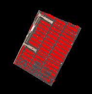

# Spaceknow Cars Analyser in Python
This package written in Python encapsulates [SpaceKnow API](https://spaceknow.com/), as documented [here](https://docs.spaceknow.com), and provides a simple interface for performing analysis of car numbers within desired area.
## Key Features
- Counts cars
- Highlights cars and prints image
## Usage
The entrypoint of the package is a class called `SpaceknowCarsAnalyser` located in the `spaceknow.interface` module. A construction of an object requests passing in client's credentials (username, password) as arguments with optional argument of a logger that logs out activities (e.g. built-in function print).
```Python
from spaceknow.interface import SpaceknowCarsAnalyser

username = "user-name@spaceknow.com"
password = "password"
sk_analyser = SpaceknowCarsAnalyser(username, password)
```
On the created object may be called a method called `analyse_on`, that accepts arguments: extent (`GeoJSON` object representing required area), from_date_time (lower bound for querying satelite images) and to_date_time (upper bound for querying satelite images). This method prepares satelite images in acordance with the requirments stated in arguments of the method.
```Python
from geojson import Polygon
from datetime import datetime

extent = Polygon(
    [
        [
            (153.10478095093333,-27.390398450838056),
            (153.10668832863644,-27.391102659318708),
            (153.10534310906212,-27.393405862986185),
            (153.10364951776478,-27.392496065380755),
            (153.10478095093333,-27.390398450838056)            
        ]
    ])
from_date_time = datetime(2018,1,5,0,0,0)
to_date_time = datetime(2018,1,30,0,0,0)
```
The method then returns an object, on which desired analysis may be caried out. Currently, there are available only 2 options. First, count cars within the given extent, the given time period (returns list of (date, number) pairs)
```Python
car_results = sk_analyser.analyse_on(extent, from_date_time, to_date_time).get_car_counts()
```
and second, print satelite view of the area with highlighted cars in it (returns list of (date, image) pairs)
```Python
image_results = sk_analyser.analyse_on(extent, from_date_time, to_date_time).get_images()
```
The returned image object is of type `PIL.Image.Image` and may be therfore easily showed via method `Image.Show()`. The resultant image, for a extent given above, looks like this
<p align="center">

</p>

## Instalation
To install required dependencies execute
```
pip install -r requirments.txt
```
to install the package execute
```
python setup.py install
```
